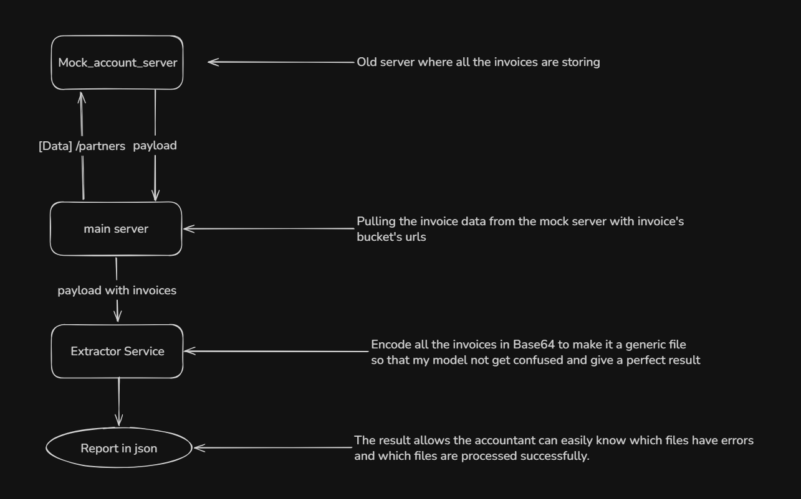
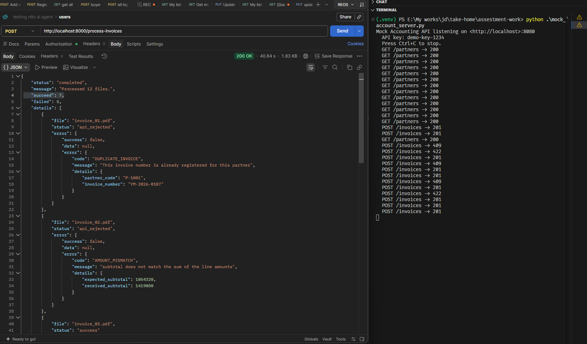

# Project Overview

## Architecture

## Result (Took 40.64 seconds to complete)

## Conclusion

Based on the 12 provided sample invoices, the automated pipeline successfully processed and registered 7 files, while 5 files were gracefully rejected by the mock API's strict business logic. 

### Succeeded Files (7)
These files were accurately extracted by the Vision-Language Model, passed strict Pydantic schema validation, and mathematically matched the API's internal recalculations:
- `invoice_03.pdf`
- `invoice_05.jpg`
- `invoice_06.jpg`
- `invoice_08.jpg`
- `invoice_10.jpg`
- `invoice_11.jpg`
- `invoice_12.jpg`

### Flagged for Human Review (5)
These files successfully completed the AI extraction phase but were correctly rejected by the API's defensive traps. In a production environment, these would automatically be routed to an accountant's "Needs Human Review" queue:

* **Duplicate Invoices (`invoice_01.pdf`, `invoice_04.jpg`, `invoice_07.jpg`):** Rejected with a `409 DUPLICATE_INVOICE` error. The API successfully caught that these invoice numbers were already registered for these specific partners, proving the system prevents double-payments.
* **Math Discrepancy (`invoice_02.pdf`):** Rejected with an `AMOUNT_MISMATCH` error. The printed subtotal extracted from the invoice did not mathematically match the sum of its extracted line items.
* **Rounding Edge Case (`invoice_09.pdf`):** Rejected with an `AMOUNT_MISMATCH` error due to a 1-yen difference in the total amount. This successfully caught a classic accounting edge case where the supplier's line-item tax rounding rules differ from the API's subtotal-level `math.floor()` tax calculation.

By allowing the API to act as the final mathematical source of truth, the pipeline ensures no malformed or logically inconsistent data is ever blindly registered into the accounting system.